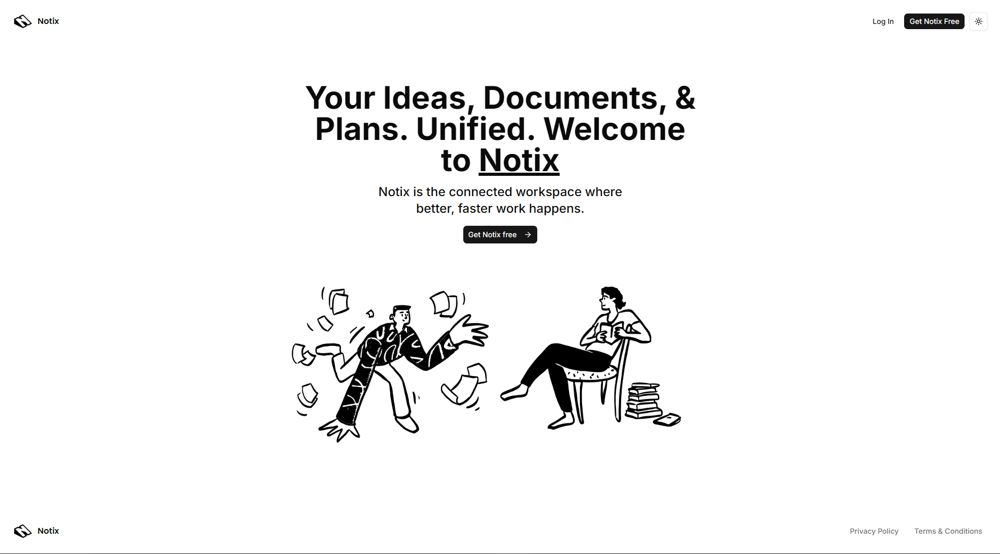
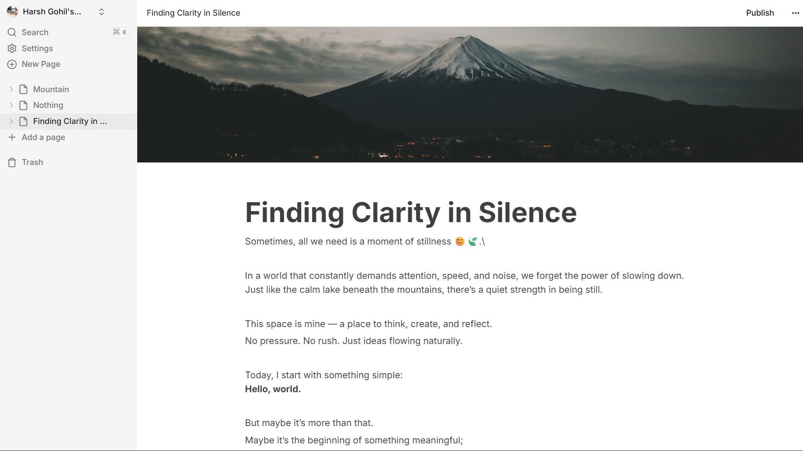
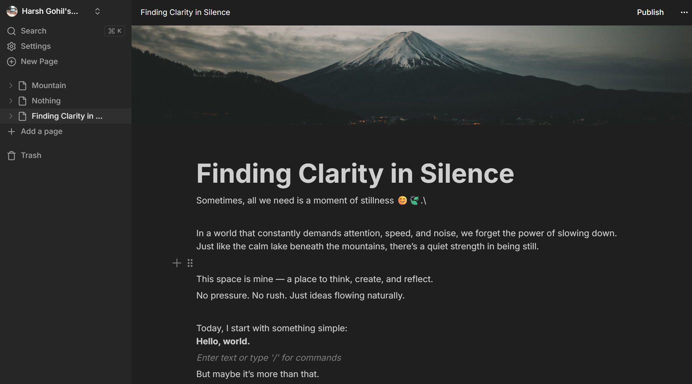

# 📝 Notix – Notion Clone

Notix is a modern **Notion-style note-taking web app** built with powerful tools like Clerk, Convex, and Edge Store. It allows users to create, manage, and organize notes with a clean and responsive UI.

---

## 🌐 Live Demo

[](https://notix-x8.vercel.app)
---

## 📸 Screenshots






---

## 🚀 Features

- 🔐 **Authentication**
  - Secure login/signup using Clerk
  - Session handling with modern auth flow

- ⚡ **Backend with Convex**
  - Real-time database using Convex
  - Fast and scalable data handling

- 📄 **Note Management**
  - Create new notes
  - Edit content with rich text editor
  - Add headings and structure content

- 🗂️ **File System**
  - Archive notes
  - Restore archived notes
  - Permanent delete with confirmation

- 🔍 **Search Functionality**
  - Quickly search notes by title/content

- 🖼️ **Image Upload**
  - Upload and manage images using Edge Store

- 🎨 **UI Features**
  - Dark mode / Light mode toggle
  - Clean and minimal UI (Notion-inspired)

---

## 🛠️ Tech Stack

- **Frontend**: Next.js, React
- **Backend**: Convex
- **Authentication**: Clerk
- **Storage**: Edge Store
- **Styling**: Tailwind CSS

---

## 📦 Installation

```bash
# Clone the repository
git clone https://github.com/harshintech/notix.git

# Navigate to project folder
cd notix

# Install dependencies
npm install

# Run the development server
npm run dev

#Run convex
npx convex dev
```

---

## 🔑 Environment Variables

Create a `.env.local` file and add:

```env
CONVEX_DEPLOYMENT=
NEXT_PUBLIC_CONVEX_URL=
NEXT_PUBLIC_CONVEX_SITE_URL=
NEXT_PUBLIC_CLERK_PUBLISHABLE_KEY=

CLERK_SECRET_KEY=
CLERK_FRONTEND_API_URL=

EDGE_STORE_ACCESS_KEY=
EDGE_STORE_SECRET_KEY=
```

---

## 🎯 Future Improvements

- Real-time collaboration
- Sharing notes with others
- Markdown support
- Mobile optimization

---

## 🤝 Contributing

Contributions are welcome!
Feel free to fork the repo and submit a PR.

---

## 📄 License

This project is licensed under the MIT License.

---

## ⭐ Support

## If you like this project, give it a ⭐ on GitHub!
